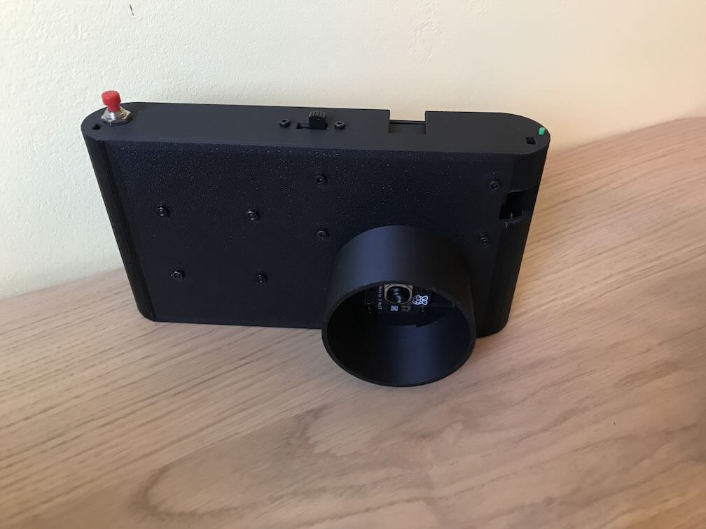
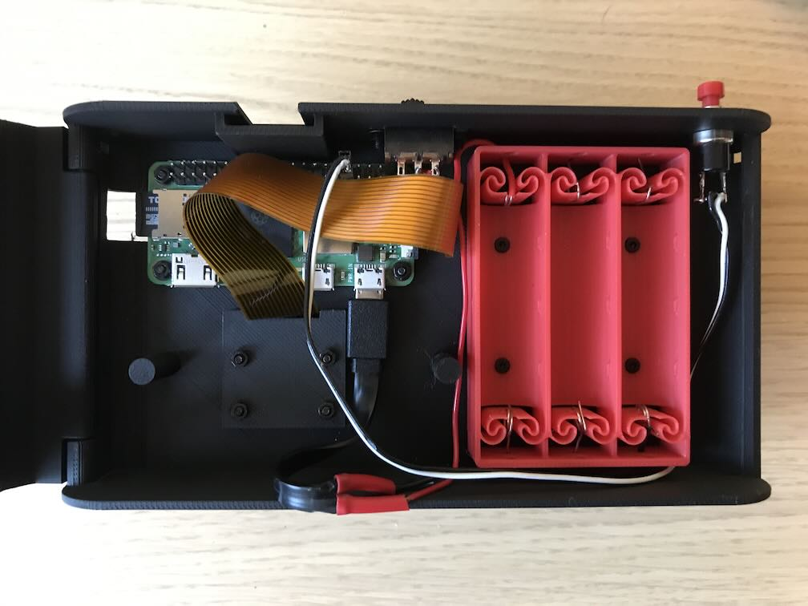
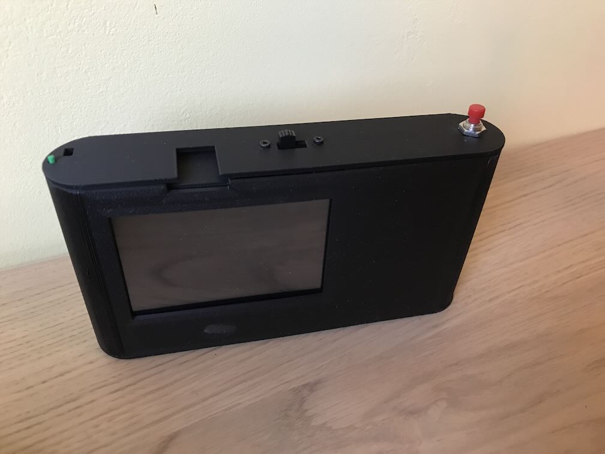

# camera-pizero
Raspberry Pi Zero and Raspberry Pi Camera Module based camera



I wanted to make an IR camera for landscape photos.

It uses the Raspberry Pi Camera Module 3 NOIR which has autofocus, a Raspberry Pi Zero 2W for the size and ok performance, a generic 3.5in LCD SPI screen from Elecrow I had around, trigger push button hole, on-off switch mount for saving battery power and normal AA instead of one of a kind USB charge-banks and uses printable battery holder to make the project easily reproducible. Note that any Raspberry Pi zero can be used instead or any Raspberry Pi Camera module from 1 to 3.

Using the Raspberry Pi OS Lite (64bit) bookworm 2024-11-29 and the code has a hack for an existing bug that will be patched in the future so  will require a code change for future releases.

The camera also has a hole for tripod mount where a nut can be glued if needed, has holes for straps (peak design compatible) and cold shoe accessory mount for viewfinders and other accessories. Do not use a flash as the metal contacts can scratch the print.

TODO: Mount for cokin filters.

## BOM
* Raspberry Pi Zero
* Raspberry Pi Camera Module
* Extendded camera ribbon for pi zero
* 3.5in LCD SPI Raspberry Pi Screen
* 7mm push button
* 2-pin female housing connector
* Mini Slide Switch 2-Position SPDT
* [AA Makeshift Battery Holder 3](https://makerworld.com/en/models/452852-aa-makeshift-battery-holder-1-2-3-4-6-8-10-12#profileId-360121)
* 3xAA Batteries
* Micro-USB cable
* 2x M2.5 4mm screws
* 4x M2.5 6mm screws
* 4x M2 6mm screws
* 4x M2 10mm screws
* 6x M2.5 nuts
* 8x M2 nuts

## Assembly instructions



1. Wire the push button to the 2-pin female housing connector.
2. Wire the Battery Holder and Slide Switch and the micro usb cable by cutting off the USB-A connector.
3. Connect the camera module to the raspberry pi through the cable hole.
4. Assemble the camera module with the hood on the case with the M2 10mm screws and nuts.
5. Assemble the raspberry pi on the case with the  M2.5 6mm screws and nuts.
6. Assemble the Slide Switch to the case with the M2.5 4mm screws.
7. Assemble the Push Button on the case.
8. Assemble the Battery Holder to the case with 6mm screws and nuts and screw heads on the inside.
9. Connect the push button connector to the pins 33/34 of the raspberry pi.
10. Connect the micro-usb connector to the power connector (right) of the raspberry pi.
11. Connect the screen to the raspberry pi.
12. Assemble the cover to case using a length of spare print filament.
13. Insert memory card if not done prior to assembly.
14. Insert batteries.

Note: During the software installation better use a usb power supply.


## Software
Prequesistes
* Raspberry Pi OS Lite bookworm

Copy the repository in the Raspberry pi and run the install script:
```
cd camera-pizero/src/
sudo bash install.sh
```

